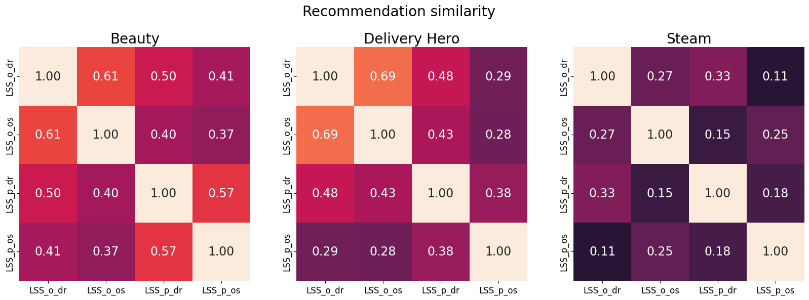
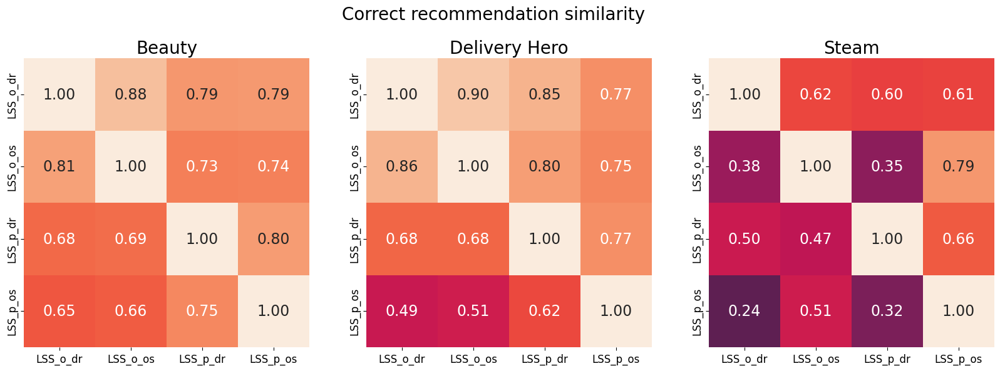

# Implementation details

## Neural models

Our implementations of BERT4Rec, SASRec and GRU4Rec are subclasses of our `NeuralModel`
in `main/neural_model.py`, which contains all functionality for training and predicting
with a Keras model. Here, we take 10% of the train sessions (with a maximum of 500
sessions) and place them in an "inner-validation" set, and use the inner-validation set
for early stopping. More specifically, after each epoch, we evaluate the model on
NDCG@20 on the inner-validation set. If the model has not improved the inner-validation
NDCG@20 for 2 epochs, we stop training and restore the model weights to the epoch with
the best inner-validation NDCG@20. Using the inner-validation NDCG@20 prevents our
models from overfitting on the data. Note that 2 epochs may seem like a short
early-stopping patience, but our models generally converge within 5-15 epochs, even with
lower learning rates. Therefore, even with higher values for the early-stopping
patience, the model weights will often be restored to the same epoch, so higher values
for the early-stopping patience would result in more superfluous training.

Note that all our neural models have the hyperparameter __N__, which is used to truncate
long sessions to the last __N__ items. This is to ensure that sessions fit in the same
tensor. We choose N = 20 for both the Beauty and the Delivery Hero dataset.

Lastly, we train all models with the Keras AdamW optimizer.

### BERT4Rec

We implemented BERT4Rec largely following the specifications in
the [BERT4REC paper](https://dl.acm.org/doi/abs/10.1145/3357384.3357895) [1] with the
transformer architecture described in [2]. A minor difference with our implementation is
the initialization method: in our implementation we use the keras default GlorotUniform,
except for the bias layer. The latter is initialized with zeros.
The [accompanying implementation](https://github.com/FeiSun/BERT4Rec/blob/615eaf2004abecda487a38d5b0c72f3dcfcae5b3/modeling.py#L371)
of the paper uses the truncated normal distribution, but we found that this initializer
generally resulted in slightly lower performance than the initialization method
described above.

### SASRec

SASRec mainly adheres to the specifications in the
original [SASRec paper](https://arxiv.org/abs/1808.09781) [3]. Note that SASRec in [3]
proposes a different transformer layout than the one used in BERT4Rec and Attention is
all you need [2]. SASRec in [3] additionally uses a dropout layer on the embeddings.
Also, they originally only use one head instead of multi-head attention, and have some
experiments demonstrating that using multiple heads did not lead to performance
increases with their implementation. We accomodate the aforementioned differences with
BERT4Rec in our SASRec implementation and allow for a variable number of heads.
Moreover, we use the projection head from BERT4Rec instead of the prediction layer
described in [3] because we found it generally improved performance. Lastly, our SASRec
implementation is trained with categorical cross-entropy loss, again similar to
BERT4Rec, without the negative sample described in [3].

### GRU4Rec

Our GRU4Rec implementation slightly deviates from the
original [GRU4Rec paper](https://arxiv.org/pdf/1511.06939.pdf) [4]. Instead of the
session-parallel mini-batches, we train GRU4Rec using whole sessions in a batch. This
way, the data generator that we need conveniently coincides with the one for SASRec. By
processing sessions as a whole, we do not have to reset the internal state during a
batch which makes the implementation overall much simpler. One side-effect of this is
that GRU4Rec becomes unable to process sessions longer than its parameter __N__, but we
generally found that truncating sessions to a sensible length improves performance,
likely due to the removal of noise from the long-tail of the sessions. Furthermore, we
simply train GRU4Rec with categorical cross-entropy loss, and we did not encounter the
instability reported in [4] caused by this loss function. Lastly, we re-use the
projection head from BERT4Rec instead of the dense prediction layer described in [3].
This improved model performance, as re-using the item embeddings in the projection head
basically halves the model's size and thus alleviates overfitting.

## SKNN

We implemented SKNN according to the specifications in [5]. Our implementation
parameterizes and adds several options. First of all, both dot-product and cosine
similarity are supported. We parameterize the sampling strategy and support both the
random sampling of sessions, and prioritizing recent sessions (if the timestamp is
available). We added the parameter `idf_weighting`, which if set, weighs items
proportional to their IDF-score when computing the session similarity. The `SKNN` class
supports all variants of SKNN presented in [5], including V-SKNN (using the `decay`
parameter), SF-SKNN (with `sequential_filter` set to `true`), S-SKNN (
with `sequential_weighting` set to `true`) and regular SKNN. For V-SKNN, we use harmonic
decay.

We support the embedding version of the model in the same class by
using `use_item_embeddings` config and providing the necessary parameters, which are:

- `prompt_session_emb_comb_strategy`
- `training_session_emb_comb_strategy`
- `dim_reduction_config`
- `decay`
- `training_session_decay`

## Hybrids

### Embedding Model Ensemble Using Rank & Confidence

`LLMSeqSim` is built on four primary dimensions: (i) the source LLM embedding model that
provides the embeddings of items, (ii) the dimensionality reduction methods that take
the embeddings to a lower dimensional space, (iii) the number of reduced dimensions,
and (iv) the session embedding computation that aggregates the individual item
embeddings. Different configurations of these elements can create a mosaic of embedding
models that manifest diverse and complementary characteristics.

In the interest of time we did not combine all possible `LLMSeqSim` variations. Instead,
we selected the best performing configurations deduced from hyperparameter search for
four `LLMSeqSim` variants defined by a) the source of LLM embedding model (OpenAI or
Google) and b) the use or not of dimensionality reduction on the retrieved embeddings.
We picked these two aspects to base the creation of `LLMSeqSim` variations on grounds of
potential impact to the performance of the model and complementarity between the
variations.

We motivate this intuition using an analysis of the intersection of recommendations
across `LLMSeqSim` variations. Figure *Recommendation similarity* shows that the
recommendations are surprisingly distinct and can be combined to create unique
recommendation slates by means of rank or confidence. Such an ensemble holds the
potential of encapsulating complementary semantic signals that boost recommendation
performance. In addition, Figure *Correct recommendation similarity* visualizes the
prospect of each `LLMSeqSim` combination in terms of the intersection of correct
recommendations. The asymmetry of pairwise scores in the Figure is owed to the different
number of correct recommendations scored by each individual model, which is used
as denominator to compute the percentage scores.

Abbr.: **LSS**: `LLMSeqSim`, **o**: OpenAI ada embedding source, **p**: Google PaLM2
embedding source, **os**: original embedding size, **dr**: reduced embedding size

# Data

We preprocessed Beauty using the 5-core methodology, meaning we iteratively remove
sessions and items until all sessions and items have at least five interactions. Note
that in our test prompts there is a small amount of sessions that have less than five
interactions. This is a result of our `filter_non_trained_test_items` flag
in `beauty/split_sessions`, which removes all items from the prompts that were not
included in the training data. In some rare cases, all five (or more) interactions of an
item only appear in the test set, causing them to be filtered from the test prompts.

We preprocessed Steam in the same manner.

We do not apply any pre-processing to our Delivery Hero QCommerce sessions dataset to
better simulate a real-world setting, except that we removed sessions with only one
interaction from the test set.

For all datasets, we employ a temporal splitting strategy to separate the data into a
train and test set. So, all test sessions succeed train sessions in time. We believe
that the temporal splitting strategy best simulates a real-world setting in comparison
to other splitting strategies in the literature (evolving [1] or simple random
sampling).

# Hypersearch

We hypersearch (hyperparameter-search) all models, except the LLMSeqPrompt variants and
the hybrids, with a Tree-Parzen-Estimator (TPE) sampler [7]. The
optimization objective is the average validation NDCG@20 across the three folds. We
start with 40 randomly-sampled configurations to avoid premature biases and then
continue by evaluating the suggestions by the TPE sampler. We stop the hypersearch if
the optimization objective has not been improved for 100 trials. We preempt the
hypersearch if it has not stopped after 72 hours. We hypersearch the LLMSeqPrompt
variants and the hybrids manually.

The folds themselves are created by splitting the training data into validation-training
and validation-testing sets. We again do this in a temporal fashion by splitting the
train sessions into four bins, where the first bin contains the first 25% training
sessions etc. The first fold then uses the first bin as the validation-training data,
and uses the second bin as the validation-testing data. The second fold then uses the
first and second bin as the validation-training data, and the third as the
validation-testing data. The third fold uses the first three bins as the
validation-training data, and the fourth as the validation-testing data. By using fewer
data in the first few folds (in comparison to cross-validation), we can more quickly
evaluate a configuration and preserve the temporal split in our hypersearch process as
well.

We validate our approach by finding that the average validation NDCG@20 of a model
configuration is strongly correlated with the final NDCG@20 of a model configuration
trained on the whole training data, evaluated on the hidden test set. We also found that
the validation NDCG@20 on individual folds are correlated with the final NDCG@20, which
suggests we can use pruning. Therefore, after each fold we prune the model
configurations in the bottom 20% of validation NDCG@20 to speed up our hypersearch.

## LLMSeqPrompt

For the `LLMSeqPrompt` model, we hypersearch the prediction parameters. It would have
been too costly and time-consuming to hypersearch the training parameters (e.g. learning
rate, batch size, prompt_loss_weight), and hence we resorted to simply training the
model with the default training parameters. For prediction, we considered `temperature`
and `top_p` to be influential parameters.
These variables basically control the diversity of the completion, and can hence be used
to control the amount of duplicates and hallucinations in the predictions by the
fine-tuned model. We hypothesized that decreasing the amount of duplicates or
hallucinations would improve performance.
Since [the OpenAI API reference](https://platform.openai.com/docs/api-reference/completions/create)
generally recommends altering `temperature` or `top_p` but not both, we fix `top_p`
and hypersearch `temperature` and vice versa for GPT `ada`.
Based on this experience and the limitations of such a hyperparameter search, we fix `top_p` to 1
and only hypersearch `temperature` for GPT and PaLM.

## Hyperparameter ranges

The searched hyperparameter ranges are listed below. An "*" (asterisk) denotes that the
range is the same throughout the column. An "-" (hyphen) denotes that a hyperparameter
is not used/hypersearched for the corresponding model.

Note that, as also mentioned in the paper, we could not use LDA with the Delivery Hero
dataset because it lacked the necessary item classes that LDA needs.

|                  | **learning_rate** | **weight_decay** | **clipnorm**  | **fit_batch_size** | **emb_dim** | **drop_rate** | **L** | **h** | **mask_prob** | **hidden_dim** | **red_method**                           |
|------------------|-------------------|------------------|---------------|--------------------|-------------|---------------|-------|-------|---------------|----------------|------------------------------------------|
| **BERT4Rec**     | 0.0001 - 0.01     | 0-0.1            | 1-100 or None | 32-512             | 16-512      | 0-0.9         | 1-4   | 1-4   | 0.05-0.9      | -              | -                                        |
| **LLM2BERT4Rec** | *                 | *                | *             | *                  | *           | *             | *     | *     | *             | -              | PCA, Autoencoder, LDA, Random Projection |
| **SASRec**       | *                 | *                | *             | *                  | *           | *             | *     | *     | -             | -              | -                                        |
| **LLM2SASRec**   | *                 | *                | *             | *                  | *           | *             | *     | *     | -             | -              | PCA, Autoencoder, LDA, Random Projection |
| **GRU4Rec**      | *                 | *                | *             | *                  | *           | *             | -     | -     | -             | 16-512         | -                                        |
| **LLM2GRU4Rec**  | *                 | *                | *             | *                  | *           | *             | -     | -     | -             | 16-512         | PCA, Autoencoder, LDA, Random Projection |

|             | **embedding source**     | **decay**                                    | **reduced_dim_size**              | **reduction_technique**                  | **idf_weighting** | **k**  | **sample_size** | **sampling**         | **sequential_weighting** | **similarity_measure** | **training_session_decay**                   | **prompt_session_emb_comb_strategy** | **training_session_emb_comb_strategy** |
|-------------|--------------------------|----------------------------------------------|-----------------------------------|------------------------------------------|-------------------|--------|-----------------|----------------------|--------------------------|------------------------|----------------------------------------------|--------------------------------------|----------------------------------------|
| **SKNNEmb** | OpenAI ada, Google PaLM2 | {None (equal weights), "linear", "harmonic"} | {no_reduction, 64, 128, 256, 512} | PCA, Autoencoder, LDA, Random Projection | False, True       | 50-500 | 500 - 2000      | {"random", "recent"} | False, True              | {"dot", "cosine"}      | {None (equal weights), "linear", "harmonic"} | {"mean", "last"}                     | {"mean", "last"}                       |

|             | **k**  | **sample_size** | **sampling**         | **similarity_measure** |
|-------------|--------|-----------------|----------------------|------------------------|
| **SKNN**    | 50-500 | 500 - 2000      | {"random", "recent"} | {"dot", "cosine"}      |
| **S-SKNN**  | *      | *               | *                    | *                      |
| **SF-SKNN** | *      | *               | *                    | *                      |
| **V-SKNN**  | *      | *               | *                    | *                      |

|               | **embedding source**     | **combination_decay**                                                                                                   | **reduced_dim_size**              | **reduction_technique**                  | **embedding_combination_strategy** | **similarity_measure**         |
|---------------|--------------------------|-------------------------------------------------------------------------------------------------------------------------|-----------------------------------|------------------------------------------|------------------------------------|--------------------------------|
| **LLMSeqSim** | OpenAI ada, Google PaLM2 | {None (equal weights), "constant_linear", "scaling_linear", "scaling_quadratic", "log", "harmonic", "squared_harmonic"} | {no_reduction, 64, 128, 256, 512} | PCA, Autoencoder, LDA, Random Projection | {"mean", "last"}                   | {"dot", "cosine", "euclidean"} |

|                          | **top_p** | **temperature**                            | **model**       |
|--------------------------|-----------|--------------------------------------------|-----------------|
| **LLMSeqPromptGenItem**  | 1         | {0, 0.25, 0.5} (GPT), {0.125, 0.25} (PaLM) | {"GPT", "PaLM"} |         
| **LLMSeqPromptGenList**  | 1         | {0, 0.25, 0.5} (GPT), {0.125, 0.25} (PaLM) | {"GPT", "PaLM"} |
| **LLMSeqPromptClassify** | 1         | {0, 0.25, 0.5} (GPT), {0.125, 0.25} (PaLM) | {"GPT", "PaLM"} |
| **LLMSeqPromptRank**     | 1         | {0, 0.25, 0.5} (GPT), {0.125, 0.25} (PaLM) | {"GPT", "PaLM"} |

|                          | **embedding source**       | **dimensionality reduction** | **sequential model**     | **clipnorm**  | **popularity threshold** | **rank threshold** | **confidence threshold** | **diversity threshold** |
|--------------------------|----------------------------|------------------------------|--------------------------|---------------|--------------------------|--------------------|--------------------------|-------------------------|
| **EmbeddingEnsemble**    | OpenAI ada or Google PaLM2 | True or False                | -                        | -             | -                        | {0-5, 10, 20}      | linspace(0.8, 0.99, 10)  | -                       |
| **LLMSeqSim&Sequential** | *                          | *                            | LLM2BERT4Rec or SKNNwEmb | True or False | Quantiles {25, 50, 75}%  | -                  | -                        | -                       | 
| **LLMSeqSim&Popularity** | *                          | *                            | -                        | -             | Quantiles {25, 50, 75}%  | -                  | -                        | Quantiles {25, 50, 75}% |

## Optimal hyperparameters Beauty dataset

| **Model / optimal hyperparameter** | **clipnorm** | **learning_rate** | **weight_decay** | **fit_batch_size** | **emb_dim** | **drop_rate** | **L** | **h** | **mask_prob** | **hidden_dim** |
|------------------------------------|--------------|-------------------|------------------|--------------------|-------------|---------------|-------|-------|---------------|----------------|
| **BERT4Rec**                       | 92           | 0.0023            | 0.0409           | 256                | 192         | 0.4           | 1     | 2     | 0.9           | -              |
| **SASRec**                         | -            | 0.0048            | 0.0962           | 32                 | 48          | 0.25          | 2     | 3     | -             | -              |
| **GRU4Rec**                        | -            | 0.0072            | 0.0893           | 32                 | 80          | -             | -     | -     | -             | 32             |

|                  | **embedding source** | **clipnorm** | **learning_rate** | **weight_decay** | **fit_batch_size** | **emb_dim** | **red_method** | **drop_rate** | **L** | **h** | **mask_prob** | **hidden_dim** |
|------------------|----------------------|--------------|-------------------|------------------|--------------------|-------------|----------------|---------------|-------|-------|---------------|----------------|
| **LLM2BERT4Rec** | Google PaLM2         | 5            | 0.0012            | 0.0235           | 224                | 448         | LDA            | 0.45          | 2     | 1     | 0.65          | -              |
| **LLM2SASRec**   | OpenAI ada                    | 43         | 0.0001            | 0.086            | 416                | 448         | PCA            | 0             | 1     | 1     | -             | -              |
| **LLM2GRU4Rec**  | Google PaLM2                    | None         | 0.0013            | 0.0572           | 96                 | 192         | RANDOM         | -             | -     | -     | -             | 496            |

|             | **embedding source** | **decay** | **reduced_dim_size** | **reduction_technique** | **idf_weighting** | **k** | **sample_size** | **sampling** | **sequential_weighting** | **similarity_measure** | **training_session_decay** | **prompt_session_emb_comb_strategy** | **training_session_emb_comb_strategy** |
|-------------|----------------------|-----------|----------------------|-------------------------|-------------------|-------|-----------------|--------------|--------------------------|------------------------|----------------------------|--------------------------------------|----------------------------------------|
| **SKNNEmb** | Google PaLM2         | harmonic  | 512                  | lda                     | False             | 60    | 1370            | recent       | False                    | dot                    | None                       | mean                                 | mean                                   |

|             | **k** | **sample_size** | **sampling** | **similarity_measure** | **idf_weighting** |
|-------------|-------|-----------------|--------------|------------------------|-------------------|
| **SKNN**    | 140   | 1020            | recent       | cosine                 | False             |
| **SF_SKNN** | 290   | 560             | recent       | *                      | False             |
| **S_SKNN**  | 130   | 1920            | random       | *                      | False             |
| **V_SKNN**  | 320   | 1530            | random       | -                      | False             |

|               | **embedding source** | **combination_decay** | **reduced_dim_size** | **reduction_technique** | **embedding_combination_strategy** | **similarity_measure** |
|---------------|----------------------|-----------------------|----------------------|-------------------------|------------------------------------|------------------------|
| **LLMSeqSim** | OpenAI ada           | harmonic              | 512                  | PCA                     | mean                               | cosine                 |

|                          | **top_p** | **temperature** | **model** |
|--------------------------|-----------|-----------------|-----------|
| **LLMSeqPromptGenItem**  | 1         | 0.25            | GPT       |
| **LLMSeqPromptGenList**  | 1         | 0.25            | GPT       |
| **LLMSeqPromptClassify** | 1         | 0.25            | GPT       |
| **LLMSeqPromptRank**     | 1         | 0.25            | GPT       |

|                          | **embedding source**               | **dimensionality reduction** | **sequential model** | **clipnorm** | **popularity** | **rank** | **confidence** | **diversity** |
|--------------------------|------------------------------------|------------------------------|----------------------|--------------|----------------|----------|----------------|---------------|
| **EmbeddingEnsemble**    | Emb1: OpenAI ada, Emb2: OpenAI ada | Emb1: False, Emb2: True      | -                    | -            | -              | 0        | -              | -             |
| **LLMSeqSim&Sequential** | Emb: OpenAI ada, Seq: Google PaLM2 | True                         | LLM2BERT4Rec         | True         | Quantile 25%   | -        | -              | -             | 
| **LLMSeqSim&Popularity** | OpenAI ada                         | True                         | -                    | -            | Quantile 50%   | -        | -              | -             |

## Optimal hyperparameters Delivery Hero dataset

| **Model / optimal hyperparameter** | **clipnorm** | **learning_rate** | **weight_decay** | **fit_batch_size** | **emb_dim** | **drop_rate** | **L** | **h** | **mask_prob** | **hidden_dim** |
|------------------------------------|--------------|-------------------|------------------|--------------------|-------------|---------------|-------|-------|---------------|----------------|
| **BERT4Rec**                       | 57           | 0.0002            | 0.0618           | 160                | 224         | 0.45          | 4     | 4     | 0.45          | -              |
| **SASRec**                         | -            | 0.0011            | 0.042            | 448                | 416         | 0.15          | 1     | 1     | -             | -              |
| **GRU4Rec**                        | -            | 0.0026            | 0.0881           | 160                | 512         | -             | -     | -     | -             | 352            |

|                  | **embedding source** | **clipnorm** | **learning_rate** | **weight_decay** | **fit_batch_size** | **emb_dim** | **red_method** | **drop_rate** | **L** | **h** | **mask_prob** | **hidden_dim** |
|------------------|----------------------|--------------|-------------------|------------------|--------------------|-------------|----------------|---------------|-------|-------|---------------|----------------|
| **LLM2BERT4Rec** | OpenAI ada           | 5            | 0.0001            | 0                | 256                | 224         | PCA            | 0.1           | 4     | 4     | 0.25          | -              |
| **LLM2SASRec**   | Google PaLM2         | 39           | 0.0002            | 0.0668           | 480                | 288         | PCA            | 0.15          | 1     | 3     | -             | -              |
| **LLM2GRU4Rec**  | OpenAI ada           | 13           | 0.0017            | 0.0264           | 96                 | 288         | RANDOM         | -             | -     | -     | -             | 176            |

|             | **embedding source** | **decay** | **reduced_dim_size** | **reduction_technique** | **idf_weighting** | **k** | **sample_size** | **sampling** | **sequential_weighting** | **similarity_measure** | **training_session_decay** | **prompt_session_emb_comb_strategy** | **training_session_emb_comb_strategy** |
|-------------|----------------------|-----------|----------------------|-------------------------|-------------------|-------|-----------------|--------------|--------------------------|------------------------|----------------------------|--------------------------------------|----------------------------------------|
| **SKNNEmb** | OpenAI ada           | linear    | 512                  | PCA                     | True              | 480   | 1920            | random       | False                    | dot                    | harmonic                   | mean                                 | mean                                   |

|             | **k** | **sample_size** | **sampling** | **similarity_measure** | **idf_weighting** |
|-------------|-------|-----------------|--------------|------------------------|-------------------|
| **SKNN**    | 490   | 1960            | random       | cosine                 | True              |
| **SF_SKNN** | 440   | 2000            | *            | *                      | *                 |
| **S_SKNN**  | 500   | 1960            | *            | *                      | *                 |
| **V_SKNN**  | 500   | 1540            | *            | -                      | *                 |

|               | **embedding source** | **combination_decay** | **reduced_dim_size** | **reduction_technique** | **embedding_combination_strategy** | **similarity_measure** |
|---------------|----------------------|-----------------------|----------------------|-------------------------|------------------------------------|------------------------|
| **LLMSeqSim** | OpenAI ada           | None                  | 512                  | PCA                     | mean                               | dot                    |

|                         | **top_p** | **temperature** | **model** |
|-------------------------|-----------|-----------------|-----------|
| **LLMSeqPromptGenItem** | 1         | 0.25            | GPT       |

|                          | **embedding source**               | **dimensionality reduction** | **sequential model** | **clipnorm** | **popularity threshold** | **rank threshold** | **confidence threshold** | **diversity threshold** |
|--------------------------|------------------------------------|------------------------------|----------------------|--------------|--------------------------|--------------------|--------------------------|-------------------------|
| **EmbeddingEnsemble**    | Emb1: OpenAI ada, Emb2: OpenAI ada | Emb1: False, Emb2: True      | -                    | -            | -                        | -                  | 0.8                      | -                       |
| **LLMSeqSim&Sequential** | Emb: Google PaLM2, Seq: OpenAI ada | True                         | LLM2BERT4Rec         | False        | Quantile 25%             | -                  | -                        | -                       | 
| **LLMSeqSim&Popularity** | OpenAI ada                         | True                         | -                    | -            | Quantile 75%             | -                  | -                        | -                       |

## Optimal hyperparameters Steam dataset

| **Model / optimal hyperparameter** | **clipnorm** | **learning_rate** | **weight_decay** | **fit_batch_size** | **emb_dim** | **drop_rate** | **L** | **h** | **mask_prob** | **hidden_dim** |
|------------------------------------|--------------|-------------------|------------------|--------------------|-------------|---------------|-------|-------|---------------|----------------|
| **BERT4Rec**                       | 57           | 0.0002            | 0.0618           | 160                | 224         | 0.45          | 4     | 4     | 0.45          | -              |
| **SASRec**                         | -            | 0.0003            | 0.0191           | 192                | 208         | 0.15          | 4     | 3     | -             | -              |
| **GRU4Rec**                        | 34           | 0.0008            | 0.0126           | 512                | 464         | -             | -     | -     | -             | 416            |

|                  | **embedding source** | **clipnorm** | **learning_rate** | **weight_decay** | **fit_batch_size** | **emb_dim** | **red_method** | **drop_rate** | **L** | **h** | **mask_prob** | **hidden_dim** |
|------------------|----------------------|--------------|-------------------|------------------|--------------------|-------------|----------------|---------------|-------|-------|---------------|----------------|
| **LLM2BERT4Rec** | OpenAI ada           | None         | 0.0002            | 0.0301           | 352                | 496         | PCA            | 0.45          | 3     | 2     | 0.55          | -              |
| **LLM2SASRec**   | Google PaLM2         | 30           | 0.0004            | 0.0458           | 512                | 400         | PCA            | 0.1           | 3     | 4     | -             | -              |
| **LLM2GRU4Rec**  | OpenAI ada           | None         | 0.0008            | 0.0742           | 160                | 448         | RANDOM         | -             | -     | -     | -             | 400            |

|             | **embedding source** | **decay** | **reduced_dim_size** | **reduction_technique** | **idf_weighting** | **k** | **sample_size** | **sampling** | **sequential_weighting** | **similarity_measure** | **training_session_decay** | **prompt_session_emb_comb_strategy** | **training_session_emb_comb_strategy** |
|-------------|----------------------|-----------|----------------------|-------------------------|-------------------|-------|-----------------|--------------|--------------------------|------------------------|----------------------------|--------------------------------------|----------------------------------------|
| **SKNNEmb** | OpenAI ada           | linear    | 512                  | PCA                     | True              | 210   | 1030            | recent       | True                     | dot                    | harmonic                   | mean                                 | mean                                   |

|             | **k** | **sample_size** | **sampling** | **similarity_measure** | **idf_weighting** |
|-------------|-------|-----------------|--------------|------------------------|-------------------|
| **SKNN**    | 500   | 1410            | recent       | cosine                 | True              |
| **SF_SKNN** | 500   | 1530            | recent       | *                      | *                 |
| **S_SKNN**  | 490   | 1960            | random       | *                      | *                 |
| **V_SKNN**  | 490   | 850             | recent       | -                      | *                 |

|               | **embedding source** | **combination_decay** | **reduced_dim_size** | **reduction_technique** | **embedding_combination_strategy** | **similarity_measure** |
|---------------|----------------------|-----------------------|----------------------|-------------------------|------------------------------------|------------------------|
| **LLMSeqSim** | OpenAI ada           | constant_linear       | 512                  | PCA                     | mean                               | dot                    |

|                         | **top_p** | **temperature** | **model** |
|-------------------------|-----------|-----------------|-----------|
| **LLMSeqPromptGenItem** | 1         | 0.5             | GPT       |

|                          | **embedding source**               | **dimensionality reduction** | **sequential model** | **clipnorm** | **popularity threshold** | **rank threshold** | **confidence threshold** | **diversity threshold** |
|--------------------------|------------------------------------|------------------------------|----------------------|--------------|--------------------------|--------------------|--------------------------|-------------------------|
| **EmbeddingEnsemble**    | Emb1: OpenAI ada, Emb2: OpenAI ada | Emb1: False, Emb2: True      | -                    | -            | -                        | 1                  | -                        | -                       |
| **LLMSeqSim&Sequential** | Emb: OpenAI ada, Seq: OpenAI ada   | True                         | LLM2BERT4Rec         | True         | Quantile 25%             | -                  | -                        | -                       | 
| **LLMSeqSim&Popularity** | OpenAI ada                         | True                         | -                    | -            | Quantile 50%             | -                  | -                        | -                       |

# Additional discussion

To reiterate our discussion on the results in our paper:

- The gains obtained by initializing neural models with semantically-rich embeddings are
  substantial. We confirmed that the driver of performance are the semantics, instead of
  any statistical properties of the LLM embeddings. We did this by permuting the
  embeddings across the item catalogue, and found that the performance degraded heavily
  to the point where LLM2BERT4Rec had worse performance than vanilla BERT4Rec.

- The `LLMSeqSim` model performance varies across datasets. On Beauty, it is highly
  competitive, whereas on our Delivery Hero dataset the model has poor performance. The
  substantially-higher number of infrequent items makes it harder for the `LLMSeqSim` to
  find the correct recommendation. Furthermore, we find that in the Beauty dataset,
  items in the same session are often semantically related, most often through the brand
  names. In our Delivery Hero dataset, this is not the case. In addition, we find
  that `LLMSeqSim` has a high Catalog Coverage, since it does not take item popularity
  into account.

- The `SKNN` models are, though non-neural, very competitive in performance, especially
  on short sessions. See `notebooks/session_length_hitrate_*.ipynb` for SKNN's
  performance against session length.

This section is intended to extend this discussion.

## Other string embedders

We experimented with other string embedders than the `text-embedding-ada-002` embedder
from OpenAI. The fact that retrieving the LLM Embeddings from OpenAI is pay-per-use
limits its usability, and so we experimented with open-source embedders. We
found [GenSim, topic modelling for humans](https://radimrehurek.com/gensim/models/word2vec.html)
to have a Python API for retrieving word embeddings. Since these embedders map
individual words to embeddings, not whole strings, we take the average of the embeddings
of each individual word in the product names, if it exists in the vocabulary. We
subsequently used these embeddings in our `LLMSeqSim` model. Surprisingly, the model
with these open-source embeddings resulted in very poor performance and barely beat
the `MostPopular` baseline. For example, the best model (of the open-source embedders)
was `LLMSeqSim` with the `glove-wiki-gigaword-300` vocabulary with a NDCG@20 of 0.012
and HitRate@20 of 0.03. We attribute the difference in performance between the OpenAI
LLM Embeddings and the embeddings by the open-source embedders to the fact
that `text-embedding-ada-002` is able to embed the string as a whole, and recognizes
brand names much more often. The former means that OpenAI *probably* has a more
sophisticated mechanism in place to combine the embeddings of the tokens in the product
name instead of the simple averaging we attempted for the open-source embeddings. The
latter, recognizing brand names, seems to be a vital factor in performance when looking
at the recommendations on an individual session level. The sessions for which
the `LLMSeqSim` with `text-embedding-ada-002` embeddings correctly predicted the last
item often had a strong semantic connection between the last item in the prompt and the
ground-truth item. Most-often this semantic connection was through the brand name, and
thus the performance of  `LLMSeqSim` with `text-embedding-ada-002` embeddings is
significantly better than the performance of  `LLMSeqSim` with open-source embeddings.

## Hybrid performances

Below we provide the performance values of the hybrids using the optimal configurations.

### Beauty dataset

|                          | **NDCG@10** | **HitRate@10** | **NDCG@20** | **HitRate@20** |
|--------------------------|-------------|----------------|-------------|----------------|
| **EmbeddingEnsemble**    | 0.043       | 0.067          | 0.049       | 0.090          |
| **LLMSeqSim&Sequential** | 0.040       | 0.074          | 0.050       | 0.116          |
| **LLMSeqSim&Popularity** | 0.042       | 0.065          | 0.049       | 0.093          |

### Delivery Hero dataset

|                          | **NDCG@10** | **HitRate@10** | **NDCG@20** | **HitRate@20** |
|--------------------------|-------------|----------------|-------------|----------------|
| **EmbeddingEnsemble**    | 0.040       | 0.073          | 0.047       | 0.102          |
| **LLMSeqSim&Sequential** | 0.099       | 0.175          | 0.117       | 0.247          |
| **LLMSeqSim&Popularity** | 0.051       | 0.091          | 0.060       | 0.126          |

### Steam dataset

|                          | **NDCG@10** | **HitRate@10** | **NDCG@20** | **HitRate@20** |
|--------------------------|-------------|----------------|-------------|----------------|
| **EmbeddingEnsemble**    | 0.026       | 0.046          | 0.031       | 0.068          |
| **LLMSeqSim&Sequential** | 0.067       | 0.126          | 0.083       | 0.192          |
| **LLMSeqSim&Popularity** | 0.023       | 0.044          | 0.030       | 0.068          |

# References

[1] Fei Sun, Jun Liu, Jian Wu, Changhua Pei, Xiao Lin, Wenwu Ou, and Peng Jiang. 2019.
BERT4Rec: Sequential Recommendation with Bidirectional Encoder Representations from
Transformer. In Proceedings of the 28th ACM International Conference on Information and
Knowledge Management (CIKM ’19). 1441–1450.

[2] Ashish Vaswani, Noam Shazeer, Niki Parmar, Jakob Uszkoreit, Llion Jones, Aidan N
Gomez, Ł ukasz Kaiser, and Illia Polosukhin. 2017. Attention is All you Need. In
Advances in Neural Information Processing Systems, Vol. 30. Curran Associates, Inc.

[3] Wang-Cheng Kang and Julian J. McAuley. 2018. Self-Attentive Sequential
Recommendation. In Proceedings of the 18th IEEE International Conference on Data
Mining (ICDM 2018). 197–206.

[4] Balázs Hidasi, Alexandros Karatzoglou, Linas Baltrunas, and Domonkos Tikk. 2016.
Session-based Recommendations with Recurrent Neural Networks. In 4th International
Conference on Learning Representations, ICLR.

[5] Malte Ludewig and Dietmar Jannach. 2018. Evaluation of Session-based Recommendation
Algorithms. User-Modeling and User-Adapted Interaction 28, 4–5 (2018), 331–390.

[6] Vito Walter Anelli, Alejandro Bellogín, Tommaso Di Noia, Dietmar Jannach, and
Claudio Pomo. 2022. Top-N Recommendation Algorithms: A Quest
for the State-of-the-Art. In Proceedings of the 30th ACM Conference on User Modeling,
Adaptation and Personalization (Barcelona, Spain) (UMAP ’22).
Association for Computing Machinery, 121–131

[7] James Bergstra, Rémi Bardenet, Yoshua Bengio, and Balázs Kégl. 2011. Algorithms for
Hyper-Parameter Optimization. In Advances in Neural Information Processing Systems, J.
Shawe-Taylor, R. Zemel, P. Bartlett, F. Pereira, and K.Q. Weinberger (Eds.), Vol. 24.
Curran Associates, Inc.
